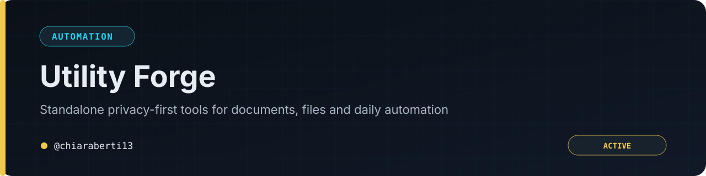

# 🛠️ Utility Forge

  <a href="README.md">🇬🇧 English</a> | <a href="README-IT.md">🇮🇹 Italiano</a>

  

Una raccolta di tool di utilità standalone, orientati alla privacy, in un unico
repository. Ogni tool è autonomo — lo apri e funziona, senza account, senza
registrazione SaaS, senza che i dati escano dal tuo browser o dal tuo server.

  
  
  
  
  

  <b>Se questi tool ti sono utili, considera di supportare il progetto:</b>  
  

---

## Indice rapido

- **[Tool disponibili](#tool-disponibili)** — Cosa c'è nella raccolta al momento: cosa
  fa ogni tool, con cosa è costruito e dove funziona.
- **[Licenza](#licenza)** — MIT, per l'intero repository e ogni cartella tool al suo
  interno.
- **[Aggiungere un nuovo tool](#aggiungere-un-nuovo-tool)** — Come un nuovo tool entra
  a far parte di questo monorepo e cosa deve riflettere il README.

> [!TIP]
> **Hai un'idea per un tool?** Apri una [issue](https://github.com/chiaraberti13/Utility-Forge/issues) — l'unico vero requisito è che sia standalone e privacy-first.

---

## Cos'è

Utility Forge è un **monorepo**: ogni tool elencato qui sotto vive nella propria
cartella, con il proprio README ed eventuali note dedicate — ma il codice vero e proprio
sta qui, in questo repository. Niente più repo sparsi da cercare: si clona questo e c'è
tutto.

I tool condividono una filosofia, non uno stack:

- **Standalone** — nessun account lato server, nessuna registrazione SaaS; di solito
  un singolo file da aprire o caricare su un server.
- **Privacy-first** — i dati vengono elaborati in locale (nel browser) o sul proprio
  server; nulla viene inviato a terzi.
- **Gratuiti e open-source**, con licenza MIT.

## Tool disponibili

| Tool | Cosa fa | Stack | Funziona su | Cartella | Docs |
|---|---|---|---|---|---|
| 📦 **EPS Barcode Generator** | Genera barcode EAN-13 in formato vettoriale EPS direttamente da un elenco Excel/CSV — in massa, con download ZIP. | HTML/JS a file singolo | Solo browser | [`barcode-eps-wizard/`](barcode-eps-wizard) | [README](barcode-eps-wizard/README-IT.md) |
| 🖼️ **PHP Image Converter** | Converte immagini tra JPG/PNG/WEBP/BMP/TIFF/GIF/HEIC, con ridimensionamento, ritagli predefiniti ed export ZIP in batch, tramite interfaccia web. | PHP a file singolo + GD/ImageMagick | Un tuo server | [`php-image-converter/`](php-image-converter) | [README](php-image-converter/README-IT.md) |
| 🕵️ **Privacy & Metadata Forensics Studio** | Ispeziona e ripulisce selettivamente i metadati nascosti (EXIF/GPS, IPTC/XMP, campi info dei PDF e segnalazione JS/allegati incorporati, modifiche tracciate/commenti/autore nei documenti Office) da immagini, PDF e documenti Office — modalità batch, profili salvati, report di audit esportabile. | HTML/JS (cartella autonoma) | Solo browser | [`privacy-metadata-scrubber/`](privacy-metadata-scrubber) | [README](privacy-metadata-scrubber/README-IT.md) |
| ✂️ **Document Redaction & Sanitization Studio** | Redazione vera, non un rettangolo nero cosmetico: rileva automaticamente dati sensibili (email, IBAN, telefoni, codice fiscale) da confermare, poi rasterizza ogni pagina così che nessun testo resti estraibile — e lo dimostra ri-estraendo il testo dal risultato. Fa anche redazione reale a livello di pixel sulle immagini. | HTML/JS (cartella autonoma) | Solo browser | [`document-redaction-studio/`](document-redaction-studio) | [README](document-redaction-studio/README-IT.md) |
| 📚 **PDF Power Suite** | Unisci, dividi, comprimi, aggiungi filigrana/numerazione Bates, OCR per PDF ricercabili, confronto tra due versioni (testuale e visivo), estrazione tabelle in CSV, mail merge da CSV a PDF compilati — più un pipeline builder per incatenare più operazioni in sequenza. | HTML/JS (cartella autonoma) | Solo browser | [`pdf-power-suite/`](pdf-power-suite) | [README](pdf-power-suite/README-IT.md) |
| 🗂️ **Batch Renamer & File Organizer Pro** | Rinomina i file direttamente in una cartella locale reale — guidato da una mappatura Excel/CSV o da un template con placeholder, con anteprima obbligatoria (controllo collisioni/caratteri non validi) e log di rollback scaricabile. | HTML/JS (cartella autonoma) | Solo browser, basato su Chromium (File System Access API) | [`batch-renamer-pro/`](batch-renamer-pro) | [README](batch-renamer-pro/README-IT.md) |

Ogni cartella è autonoma: si può aprire direttamente
`barcode-eps-wizard/barcode-eps-wizard.html` nel browser, oppure caricare
`php-image-converter/php-image-converter.php` su un server PHP — non serve nient'altro
al di fuori della propria cartella per farlo funzionare. I quattro tool più recenti
distribuiscono il proprio JavaScript come un normale file `.js` accanto all'HTML invece
di inserirlo inline (così la loro Content-Security-Policy non ha bisogno di un hash per
lo script inline), ma restano altrettanto autonomi: si apre il file `.html` e tutto ciò
che serve è già nella stessa cartella. Per le istruzioni complete di installazione e uso
vedi il README di ciascuna cartella.

Tutti e sei i tool sono stati messi in sicurezza contro le classi di bug tipiche di
questo genere di strumenti "dai i tuoi dati, ottieni un file" (injection, XSS, abuso
degli upload): validazione rigorosa degli input, una Content-Security-Policy, nomi file
sanificati, limiti dimensionali/di conteggio, rendering del DOM solo tramite
`textContent` — per i dettagli specifici e i limiti onesti di ciò che l'irrobustimento di
ciascun tool può e non può garantire, vedi il README di ciascuna cartella.

## Licenza

L'intero repository, comprese tutte le cartelle dei tool, è distribuito con **licenza
MIT** — vedi [`LICENSE`](LICENSE) per il testo completo. Puoi usarlo, studiarlo,
modificarlo e ridistribuirlo liberamente, anche commercialmente, mantenendo l'avviso di
copyright; è fornito così com'è, senza alcuna garanzia.

## Aggiungere un nuovo tool

Ogni volta che un nuovo tool viene aggiunto a questa raccolta, questo README viene
aggiornato nella stessa modifica — un nuovo tool e un indice non aggiornato non vengono
mai pubblicati separatamente. In pratica, aggiungere il tool numero *n+1* significa:

1. Creare una nuova cartella nella radice del repository, con il nome del tool.
2. Inserirci i file del tool, incluso il proprio `README.md` con le istruzioni di
   installazione e uso.
3. Aggiungere una riga alla tabella qui sopra: nome, descrizione in una riga, stack,
   dove funziona, link alla cartella.
4. Aggiornare il badge `tool-N` in cima a questo file con il nuovo conteggio.

---

  Realizzato con 🛠️ da <a href="https://github.com/chiaraberti13">chiaraberti13</a>

